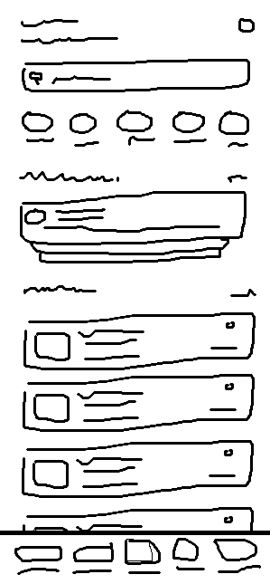
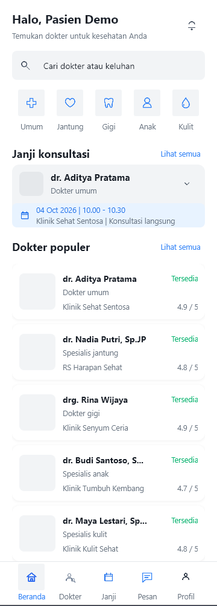
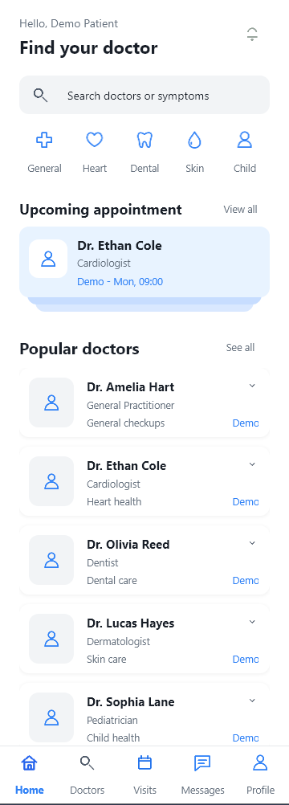
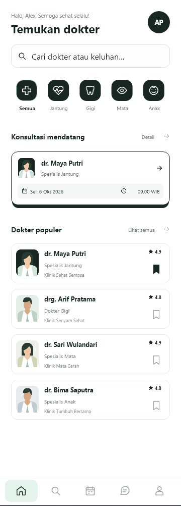

# HTML ke Delphi FMX — Versi 2


[English](README.md) | Bahasa Indonesia

Buat **UI Delphi FireMonkey native yang dapat diedit di Designer** dari HTML/CSS, screenshot, wireframe, atau deskripsi tertulis. Versi 2 mengembangkan alur konversi HTML awal menjadi enam agent skill yang saling melengkapi, termasuk pembuatan UI langsung dan review layar FMX yang sudah ada.

Skill bekerja di dalam project Delphi Anda: memeriksa konvensi project, memetakan hierarki komponen, mengintegrasikan style native, dan menghasilkan file `.fmx`/`.pas` yang dapat diedit. Repository ini menyediakan skill, contoh input, dan catatan hasil; aplikasi serta toolchain Delphi berasal dari project tujuan.

**Studi V2:** [Website bahasa Inggris](docs/result/VERSION.2.0.0/static-website/index.html) · [Presentasi Indonesia](docs/result/VERSION.2.0.0/presentation/HTML-FMX-V2-Healthcare.pptx) · [Presentasi Inggris](docs/result/VERSION.2.0.0/presentation/HTML-FMX-V2-Healthcare-EN.pptx) · [Panduan prompt](PROMPTS.md)

**Versi sebelumnya:** [Arsip V1 Indonesia](docs/result/VERSION.1.0.0/README-ID.md) · [Arsip V1 Inggris](docs/result/VERSION.1.0.0/README.md)

## Mengapa skill ini dibuat

UI FMX mobile membutuhkan keputusan layout yang sesuai dengan layar kecil, konten yang dapat di-scroll, dan navigasi sentuh. Kebiasaan desain desktop dari VCL dapat terbawa tanpa menyesuaikan kebutuhan tersebut. Mengubah setiap pembungkus HTML menjadi container FMX juga dapat menghasilkan hierarki bertumpuk yang sulit dipahami dan dipelihara.

Alur skill memberi fungsi yang jelas untuk setiap region halaman, section, card, dan container. Kontrol tetap dapat diedit di Designer RAD Studio, sedangkan record yang berubah menggunakan card reusable. Panduan desain project menjaga konsistensi warna, tipografi, jarak, dan style antarlayar.

## Perubahan pada V2

| Area | Versi 1 | Versi 2 |
| --- | --- | --- |
| Input | HTML/CSS, termasuk ekspor Google Stitch | HTML/CSS, screenshot, wireframe, dan deskripsi tertulis |
| Skill | Mapping HTML, styling CSS, dan konversi HTML | Tiga skill awal ditambah mapping screenshot, pembuatan UI langsung, dan review UI |
| Studi | Dashboard NovaPOS dengan beberapa percobaan model | Satu wireframe healthcare melalui empat alur dengan model agent yang sama |
| Panduan | Mapping komponen native dan konversi style | Penyempurnaan hierarki, kesinambungan desain, kepemilikan style, binding list/card, dan verifikasi |

## Skill yang tersedia

| Skill | Penggunaan | Hasil utama |
| --- | --- | --- |
| [`html-to-fmx-mapping`](.agents/skills/html-to-fmx-mapping/SKILL.md) | Merencanakan hierarki komponen dari HTML/CSS | Mapping UI dalam Markdown |
| [`screenshot-to-fmx-mapping`](.agents/skills/screenshot-to-fmx-mapping/SKILL.md) | Merencanakan hierarki dari screenshot atau gambar wireframe | Mapping UI dalam Markdown |
| [`css-to-fmx-style`](.agents/skills/css-to-fmx-style/SKILL.md) | Mengubah peran CSS menjadi resource FMX native yang kompatibel | `.style` dan mapping style dalam mode standalone |
| [`html-to-fmx`](.agents/skills/html-to-fmx/SKILL.md) | Mengimplementasikan desain HTML/CSS sebagai FMX native | Halaman dan card reusable `.fmx`/`.pas`, mapping UI/style |
| [`create-fmx-ui`](.agents/skills/create-fmx-ui/SKILL.md) | Membuat layar baru dari deskripsi, wireframe, atau screenshot | Halaman dan card reusable `.fmx`/`.pas`, tampilan sesuai project dan mapping |
| [`review-fmx-ui`](.agents/skills/review-fmx-ui/SKILL.md) | Memeriksa, memperbaiki, atau meningkatkan layar FMX yang sudah ada | Temuan, atau perbaikan yang diminta dengan menjaga hierarki yang sudah ada |

Simpan **keenam folder skill bersama**, termasuk file pendukungnya. `html-to-fmx` menjalankan mapping HTML dan styling CSS; `create-fmx-ui` menjalankan mapping screenshot untuk input gambar serta menggunakan referensi FMX bersama. `review-fmx-ui` menggunakan layar yang sudah ada dan referensi bersama untuk memeriksa atau memperbaikinya langsung.

Nama skill sekarang adalah **`create-fmx-ui`**. Pada percobaan healthcare, skill ini awalnya disebut `create-delphi-fmx-ui`.

## Memilih alur

| Sumber atau kebutuhan | Skill awal |
| --- | --- |
| HTML/CSS atau hasil ekspor HTML Google Stitch | `html-to-fmx` |
| Wireframe, screenshot, atau deskripsi layar | `create-fmx-ui` |
| Rencana struktur sebelum implementasi | `html-to-fmx-mapping` atau `screenshot-to-fmx-mapping` |
| Konversi style CSS ke FMX saja | `css-to-fmx-style` |
| Layar `.fmx`/`.pas` yang ingin diperiksa atau diperbaiki | `review-fmx-ui` |

Permintaan mapping standalone menghasilkan Markdown. Permintaan pembuatan/konversi dilanjutkan sampai implementasi dan pemeriksaan yang tersedia di lingkungan tujuan. Pada `review-fmx-ui`, minta **review** untuk mendapatkan temuan, **refine/fix** untuk memperbaiki masalah yang terbukti, atau **enhance** untuk meminta peningkatan tampilan atau UX.

### Kepemilikan komponen dan style

Pola bersama memisahkan struktur halaman tetap dari data yang berubah:

```text
Page / TFrame
├─ Header
├─ Scroll content
│  ├─ Search and fixed categories
│  ├─ Upcoming appointment section
│  └─ Doctors section / TListBox
│     └─ TListBoxItem                 runtime record
│        └─ DoctorCard / TFrame      reusable .fmx + .pas
└─ Bottom navigation
```

Kontrol tetap pada halaman dan card disimpan dalam `.fmx`; Pascal melakukan binding data dan membuat item list yang jumlahnya berubah. Section, card, dan grid tetap mempunyai kepemilikan yang jelas. Aksi baris, routing input, dan ukuran item list mengikuti panduan skill serta kontrak project tujuan.

Pembuatan dan konversi menggunakan `DESIGN.md` atau panduan setara milik aplikasi tujuan, atau membuat panduan ringkas ketika belum tersedia. Secara default, `create-fmx-ui` menggunakan StyleBook design-time pada main form dan menelusuri loader style yang efektif saat runtime. Sebutkan tujuan file `.style` eksternal secara eksplisit jika memang itu output yang diinginkan. Review/refinement menjaga hierarki komponen dan perilaku yang sudah ada, kecuali perubahan struktur diminta secara eksplisit.

## Mulai menggunakan

Salin seluruh paket enam skill dari `.agents/skills/` ke folder `.agents/skills/` pada project Delphi tujuan. Dari repository ini:

```powershell
$fmxSkillDest = 'D:\Path\Ke\ProjectDelphi\.agents\skills'
New-Item -ItemType Directory -Force -Path $fmxSkillDest | Out-Null
Copy-Item -Path .\.agents\skills\* -Destination $fmxSkillDest -Recurse -Force
```

Buka project tujuan di Codex dan pilih skill yang diperlukan. Jika skill yang baru disalin belum tersedia pada sesi tersebut, mulai ulang sesi. Sesuaikan semua path sumber/output dengan project tujuan.

### Membuat UI dari wireframe

Salin [wireframe healthcare](docs/result/VERSION.2.0.0/wireframe.png) ke `docs/ui/wireframe.png` pada project tujuan, atau gunakan lokasi sebenarnya pada prompt.

```text
$create-fmx-ui

Buat halaman Healthcare Appointment App dari docs/ui/wireframe.png.
Sertakan pencarian dokter/keluhan, kategori kesehatan, konsultasi yang
akan datang, daftar dokter populer, serta navigasi bawah ke pesan dan profil.

Periksa project Delphi tujuan dan DESIGN.md atau panduan setaranya.
Pertahankan UI native yang dapat diedit di Designer. Gunakan card dokter
TFrame reusable untuk record yang berubah. Ikuti kontrak style dan navigasi
yang sudah ada, lalu laporkan pemeriksaan build/Designer/runtime yang dilakukan.
```

### Mengonversi HTML/CSS

Gunakan [HTML NovaPOS](docs/ui-dashboard.html), [HTML healthcare yang dibuat agent](docs/ui-wireframe.html), atau halaman ekspor Anda sendiri. Salin sumber beserta asetnya ke project tujuan, atau berikan path sebenarnya.

```text
$html-to-fmx

Konversi docs/ui-dashboard.html menjadi halaman dashboard Delphi FMX native.
Periksa project tujuan, panduan desain, aset, dan StyleBook yang efektif.
Jalankan alur mapping serta styling. Simpan kontrol tetap agar dapat diedit
di .fmx dan gunakan card TFrame reusable untuk record yang jumlahnya berubah.
Integrasikan style dan laporkan pemeriksaan yang benar-benar dilakukan.
```

[PROMPTS.md](PROMPTS.md) memuat contoh bahasa Inggris untuk seluruh enam skill, review/refinement, dan prompt tambahan data demo. [Website healthcare](docs/result/VERSION.2.0.0/static-website/index.html#prompts) menyediakan deskripsi bersama serta empat alur percobaan dengan tombol salin. Prompt tersebut dirapikan dari deskripsi penulis, bukan transkrip persis seluruh prompt awal.

## Studi V2: Healthcare Appointment App

Input berupa wireframe coretan tangan untuk membantu pasien mencari dokter, melihat konsultasi yang akan datang, menjelajahi kategori kesehatan, dan berkomunikasi dengan penyedia layanan. Wireframe memuat pencarian, kategori, upcoming appointment, daftar dokter populer, dan navigasi bawah.



Keempat alur agent menggunakan **GPT-6.1 Sol dengan High reasoning**, wireframe yang sama, dan deskripsi healthcare yang sama. Studi ini membandingkan alur kerja. Pembuatan desain oleh Google Stitch merupakan tahap tambahan pada Metode 1.

| Metode | Alur |
| --- | --- |
| 1 | Google Stitch MCP → ekspor HTML → `html-to-fmx` |
| 2 | Wireframe + deskripsi → `create-fmx-ui` |
| 3 | `screenshot-to-fmx-mapping` → dokumen mapping terpisah → `create-fmx-ui` |
| 4 | HTML/CSS yang dibuat agent → `html-to-fmx` |

Metode 2 tetap menjalankan mapping screenshot secara internal. Metode 3 memisahkan tahap tersebut sebelum implementasi.

### Hasil runtime

Screenshot mencakup implementasi card melalui prompt tambahan serta data dummy fiktif. Sebagian label aplikasi tetap menggunakan bahasa Indonesia.

| 1. Google Stitch + HTML | 2. Pembuatan UI langsung | 3. Mapping terpisah | 4. HTML dari agent |
| --- | --- | --- | --- |
|  |  |  |  |
| [Hierarki Designer](docs/result/VERSION.2.0.0/design-time/SS-STRUKTUR-HIERARKI-MCPSTITCHHTMLHTMLTOFMX.png) | [Hierarki Designer](docs/result/VERSION.2.0.0/design-time/SS-STRUKTUR-HIERARKI-CREATEUI.png) | [Hierarki Designer](docs/result/VERSION.2.0.0/design-time/SS-STRUKTUR-HIERARKI-MAPPINGCREATEUI.png) | [Hierarki Designer](docs/result/VERSION.2.0.0/design-time/SS-STRUKTUR-HIERARKI-HTMLHTMLTOFMX.png) |

### Waktu tercatat

| Metode | UI awal | Card + data dummy | Total |
| --- | ---: | ---: | ---: |
| 1. Google Stitch + HTML | 32m 49s | 6m 06s | **38m 55s** |
| 2. Pembuatan UI langsung | 23m 25s | 2m 27s | **25m 52s** |
| 3. Mapping terpisah | 8m 16s + 41m 54s | 5m 12s | **55m 22s** |
| 4. HTML dari agent | 14m 40s | 8m 53s | **23m 33s** |

Total mencakup prompt tambahan untuk memakai card yang sudah dibuat pada halaman dan mengisinya dengan data. Pada Metode 3, mapping memakan 8m 16s dan implementasi 41m 54s; tahap mapping saja tidak menjelaskan seluruh tambahan durasi. Waktu ini berasal dari percobaan tersebut dan tidak mencakup integrasi API.

### Kesimpulan penulis

- **Hierarki komponen:** Keempat hasil mempunyai kemiripan keseluruhan sekitar **90%** menurut penulis. Angka ini merupakan estimasi pengamatan, tanpa metrik formal perbandingan tree komponen.
- **Warna desain:** Metode 1–3 mengikuti aturan warna `DESIGN.md`. Metode 4 menyimpang; prompt pembuatan HTML tidak menyebut file tersebut secara eksplisit. Instruksi tambahan pada tahap HTML menjadi usulan penyempurnaan untuk percobaan berikutnya.
- **Metode 1:** Pengelompokan visual lebih rapi dan aset lebih lengkap, dengan hasil sesuai wireframe. Urutan ketiga tercepat secara keseluruhan: 38m 55s.
- **Metode 2:** Sesuai wireframe, tetapi tampilan masih mentah seperti Metode 3. Urutan kedua tercepat: 25m 52s, dengan tambahan implementasi card paling singkat, 2m 27s.
- **Metode 3:** Paling mendekati layout wireframe menurut penulis, tetapi tampilan kurang memuaskan dan waktu paling lama, 55m 22s. Mapping terpisah tidak menghasilkan peningkatan visual yang terlihat pada percobaan ini.
- **Metode 4:** Hasil visual memuaskan meskipun paletnya menyimpang. Total tercepat: 23m 33s, hanya 2m 19s lebih singkat daripada pembuatan UI langsung.

### Kekurangan bersama: card sudah dibuat, tetapi belum dipakai di halaman

Keempat hasil awal sudah memiliki card reusable. Frame halaman belum mengimplementasikan dan mengisi card tersebut, sehingga penulis menambahkan prompt:

> Tambahkan Data dummy nya dengan card yang sudah anda buat

Versi yang lebih eksplisit:

```text
Tambahkan data dummy fiktif menggunakan card yang sudah dibuat.
Implementasikan card pada halaman UI: buat item list, pasang instance
card, lalu isi melalui binding yang sudah ada. Muat data demo sekali
saat halaman dibuat. Pertahankan binding berikutnya, termasuk hasil kosong.
```

Tahap ini digunakan ketika data demo memang diminta. Untuk layar produksi, gunakan data project yang sebenarnya dan pertahankan state loading, kosong, serta error.

## Latar belakang V1: NovaPOS

Versi 1 membentuk alur HTML → mapping komponen → style native → FMX dengan dashboard NovaPOS yang dibuat oleh Google Stitch. [HTML sumber](docs/ui-dashboard.html) dan [acuan browser](docs/result/VERSION.1.0.0/UI-HTML.png) tetap tersedia.

Contoh hasil GPT-6 Sol Medium berikut memperlihatkan struktur Designer dan runtime sebelum serta sesudah dirapikan dengan GPT-6 Sol High:

| Hierarki Designer | Runtime awal | Setelah refinement |
| --- | --- | --- |
|  |  |  |

Pelajaran utama yang dibawa ke V2 adalah kemiripan hierarki komponen antarpercobaan dan manfaat memperbaiki UI yang sudah ada. Dalam penilaian V1, **GPT-6 Astra Light → GPT-6 Sol High** memberikan visual terbaik, sedangkan **GPT-6 Sol Medium → GPT-6 Sol High** menjadi pilihan penulis untuk keseimbangan hasil dan biaya. Hasil DeepSeek menggunakan harness Codex dan tetap murni DeepSeek, tanpa refinement GPT.

Percobaan model awal dijalankan serentak; pengujian ulang dua model secara berurutan kemudian memberi hasil lebih baik. Pengamatan tersebut berlaku pada percobaan V1 dan tidak menjadi peringkat model terkini atau perbandingan dengan waktu V2. Tabel model, biaya tercatat, dan catatan historis lengkap disimpan dalam [arsip V1](docs/result/VERSION.1.0.0/README-ID.md).

## Cakupan FMX native dan verifikasi

Targetnya adalah pure Delphi FMX native, dengan kontrol tetap yang dapat diedit di Designer. Skia bersifat opsional ketika project tujuan memang sudah memakainya. Pilih ikon dan gambar yang sesuai dengan tampilan aplikasi, lalu gunakan integrasi aset yang sudah ada pada project.

Periksa kepemilikan komponen, style, aset, binding, dan navigasi pada setiap layar baru. Lakukan build, buka di Designer, dan periksa perilaku runtime pada target yang didukung ketika toolchain tersedia. Laporkan pemeriksaan source, build, Designer, runtime, dan perangkat secara terpisah. Screenshot menunjukkan hasil percobaan tercatat; gambar tidak membuktikan integrasi API baru, performa, atau penerimaan pada perangkat. Platform runtime screenshot V2 tidak disebutkan.

Project demo Delphi dan dokumen implementasi yang dihasilkan merupakan pekerjaan lokal yang tidak disertakan dalam paket publik. Preview HTML NovaPOS memuat font eksternal dan Tailwind; website studi berbahasa Inggris menyertakan aset secara lokal dan tidak memerlukan proses build. Panduan preview dan upload tersedia pada [README website](docs/result/VERSION.2.0.0/static-website/README.md).

## Struktur repository

```text
.agents/skills/                 Enam agent skill utama beserta file pendukung
docs/ui-dashboard.html          Input HTML NovaPOS V1
docs/ui-wireframe.html          Input HTML healthcare V2 yang dibuat agent
docs/result/VERSION.1.0.0/      Arsip README/prompt V1 dan hasil yang tersedia
docs/result/VERSION.2.0.0/      Wireframe, screenshot Designer/runtime, presentasi
  static-website/               Studi berbahasa Inggris dengan aset dan unduhan lokal
PROMPTS.md                      Prompt siap pakai untuk paket skill V2
README.md / README-ID.md        Dokumentasi Inggris dan Indonesia versi aktif
SOURCES.md                      Referensi dokumentasi dan pihak ketiga
LICENSE / CONTRIBUTING.md       Lisensi dan panduan kontribusi
```

## Lisensi dan kontribusi

Repository ini menggunakan [Lisensi MIT](LICENSE). Lihat [CONTRIBUTING.md](CONTRIBUTING.md) untuk panduan kontribusi dan [SOURCES.md](SOURCES.md) untuk referensi teknis.
