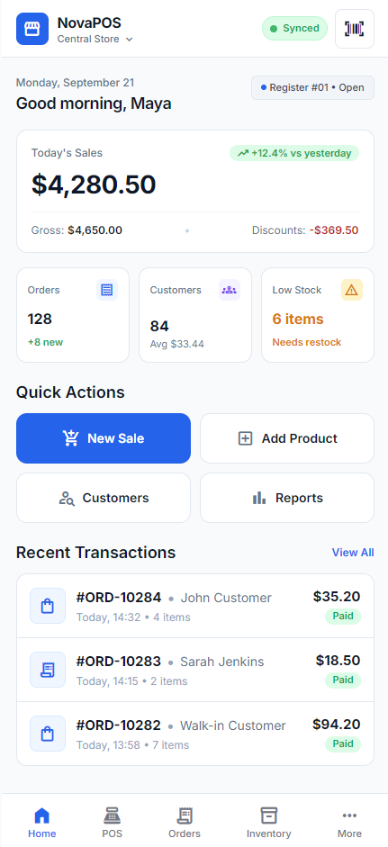

# HTML to Delphi FMX


English | [Bahasa Indonesia](README-ID.md)

Turn HTML/CSS designs into **native, editable Delphi FireMonkey UI** with three complementary agent skills. The workflow plans the component hierarchy, creates FMX style resources, and implements `.fmx`/`.pas` frames in an existing Delphi project.

This repository contains skill instructions and a documented dashboard experiment. It is not an automatic transpiler or a complete Delphi application; the target project and its toolchain determine the final implementation and validation.

## Skills

| Skill | Responsibility | Main output |
| --- | --- | --- |
| [`html-to-fmx-mapping`](.agents/skills/html-to-fmx-mapping/SKILL.md) | Map HTML regions to FMX sections, cards, fixed grids, and variable lists | Component hierarchy in Markdown |
| [`css-to-fmx-style`](.agents/skills/css-to-fmx-style/SKILL.md) | Map CSS roles to compatible native FMX style resources | `.style` and style mapping |
| [`html-to-fmx`](.agents/skills/html-to-fmx/SKILL.md) | Build the mapped UI as editable FMX frames and integrate its styles | `.fmx`/`.pas` pairs, reusable cards, and mappings |

`html-to-fmx` runs the mapping and styling workflows as sibling dependencies. Keep **all three skill directories together**. Fixed visual structure belongs in design-time `.fmx` resources; variable records use reusable `TFrame` cards inside `TListBoxItem` instances.

## Getting started

Codex discovers repository skills in `.agents/skills` from the working directory up to the repository root. Open this repository in Codex to inspect the skills, or copy the three directories into the `.agents/skills/` folder of the Delphi project where you will use them. See the [official Codex skill documentation](https://learn.chatgpt.com/docs/build-skills).

From this repository, a PowerShell copy looks like this:

```powershell
$skillDest = 'D:\Path\To\DelphiProject\.agents\skills'
New-Item -ItemType Directory -Force -Path $skillDest | Out-Null
Copy-Item -Path .\.agents\skills\* -Destination $skillDest -Recurse -Force
```

Start Codex in the target project and invoke `$html-to-fmx`, `$html-to-fmx-mapping`, or `$css-to-fmx-style`. If a newly copied skill is missing from `/skills`, restart the Codex session. For the included dashboard demo, copy [`docs/ui-dashboard.html`](docs/ui-dashboard.html) into the target project or point the prompt to its actual location.

```text
$html-to-fmx

Convert docs/ui-dashboard.html into a native FMX dashboard frame.
Inspect the existing Delphi project and StyleBook first. Save the UI and
style mappings under docs/fmx-mapping/. Keep fixed controls editable in
.fmx and use a reusable TFrame card for variable transaction records.
Build and inspect the result when the target toolchain is available.
```

See [PROMPTS.md](PROMPTS.md) for focused prompts covering mapping, styling, full conversion, and refinement. Output paths in these examples belong to the **target project**, not to this skill repository.

## Dashboard experiment

The test input is a NovaPOS dashboard page in [`docs/ui-dashboard.html`](docs/ui-dashboard.html). This is the browser reference:



The following example shows the GPT-6 Sol Medium designer structure and application run before and after a GPT-6 Sol High refinement:

| RAD Studio designer | Initial run | Run after refinement |
| --- | --- | --- |
|  |  |  |

### All attempts

The archive contains 10 designer captures, 10 initial run captures, and 8 run captures after refinement. The eight refined GPT results used GPT-6 Sol High. The DeepSeek results are **pure DeepSeek with a Codex harness**; neither has a GPT refinement image.

| Attempt | Time noted | Designer structure | Initial run | After refinement |
| --- | ---: | --- | --- | --- |
| GPT-5.6 Terra Light | 7m 21s | [View](docs/result/image-design-time/SSDT-GPT-5.6%20Terra%20Light.png) | [View](docs/result/image-run/before-enhance/SS-GPT-5.6%20Terra%20Light.png) | [View](docs/result/image-run/after-enhance/SSAF-GPT-5.6%20Terra%20Light.png) |
| GPT-5.6 Terra Medium | 12m 42s | [View](docs/result/image-design-time/SSDT-GPT-5.6%20Terra%20Medium.png) | [View](docs/result/image-run/before-enhance/SS-GPT-5.6%20Terra%20Medium.png) | [View](docs/result/image-run/after-enhance/SSAF-GPT-5.6%20Terra%20Medium.png) |
| GPT-5.6 Terra High | 13m 44s | [View](docs/result/image-design-time/SSDT-GPT-5.6%20Terra%20High.png) | [View](docs/result/image-run/before-enhance/SS-GPT-5.6%20Terra%20High.png) | [View](docs/result/image-run/after-enhance/SSAF-GPT-5.6%20Terra%20High.png) |
| GPT-6 Luna High | 21m 34s | [View](docs/result/image-design-time/SSDT-GPT-6%20Luna%20High.png) | [View](docs/result/image-run/before-enhance/SS-GPT-6%20Luna%20High.png) | [View](docs/result/image-run/after-enhance/SSAF-GPT-6%20Luna%20High.png) |
| GPT-6 Sol Light | 5m 34s | [View](docs/result/image-design-time/SSDT-GPT-6%20Sol%20Light.png) | [View](docs/result/image-run/before-enhance/SS-GPT-6%20Sol%20Light.png) | [View](docs/result/image-run/after-enhance/SSAF-GPT-6%20Sol%20Light.png) |
| GPT-6 Sol Medium | 13m 57s | [View](docs/result/image-design-time/SSDT-GPT-6%20Sol%20Medium.png) | [View](docs/result/image-run/before-enhance/SS-GPT-6%20Sol%20Medium.png) | [View](docs/result/image-run/after-enhance/SSAF-GPT-6%20Sol%20Medium.png) |
| GPT-6 Astra Light | 9m 48s | [View](docs/result/image-design-time/SSDT-GPT-6%20Astra%20Light.png) | [View](docs/result/image-run/before-enhance/SS-GPT-6%20Astra%20Light.png) | [View](docs/result/image-run/after-enhance/SSAF-GPT-6%20Astra%20Light.png) |
| GPT-6 Astra Medium | 12m 52s | [View](docs/result/image-design-time/SSDT-GPT-6%20Astra%20Medium.png) | [View](docs/result/image-run/before-enhance/SS-GPT-6%20Astra%20Medium.png) | [View](docs/result/image-run/after-enhance/SSAF-GPT-6%20Astra%20Medium.png) |
| DeepSeek V4 Pro High | 36m 29s | [View](docs/result/image-design-time/SSDT-Deepseek-V4-Pro%20High.png) | [View](docs/result/image-run/before-enhance/SS-Deepseek-v4-Pro%20High.png) | Pure DeepSeek |
| DeepSeek V4.1 Flash High | 24m 30s | [View](docs/result/image-design-time/SSDT-Deepseek-V4.1-Flash%20High.png) | [View](docs/result/image-run/before-enhance/SS-Deepseek-v4.1-Flash%20High.png) | Pure DeepSeek |

### Time and cost notes

The times above are notes from individual attempts. The author recorded these DeepSeek costs during peak hours:

| Attempt | Recorded cost |
| --- | ---: |
| DeepSeek V4.1 Flash High | **US$0.34** |
| DeepSeek V4 Pro High | **US$1.74** |

Exact GPT charges were not recorded. Based on Pro 5x usage percentages, the author estimated each Astra attempt at about **US$1** and the other GPT attempts at **under US$1**. These figures are personal estimates. The attempts used different conditions and do not form a controlled speed, cost, or quality benchmark.

## Author's takeaways

- **Lower cost, more manual work:** DeepSeek V4.1 Flash High is a starting point when you plan to refine the output yourself.
- **Strong direct output:** DeepSeek V4 Pro High produced a very good result, but its peak hours run cost more and took longer. The author expects a lower cost outside peak hours; that expectation has not been measured here.
- **Preferred overall workflow:** GPT-6 Sol Medium already looked good in the initial run. GPT-6 Sol High made it more polished. Based on Pro 5x usage, refining an existing result appeared cheaper than repeating the conversion from scratch, although exact GPT charges were not tracked.
- **Another good route:** GPT-5.6 Terra followed by GPT-6 Sol High refinement also produced a good result.
- **Designer structure:** The resulting component hierarchies were relatively similar across attempts.

For this experiment, the author's overall choice is **GPT-6 Sol Medium → GPT-6 Sol High**. **DeepSeek V4 Pro High** is also worth considering outside peak hours if its cost falls as expected.

## Repository layout

```text
.agents/skills/          Three agent skills and their supporting files
docs/ui-dashboard.html   HTML test input
docs/result/             Browser, designer, and application run captures
PROMPTS.md               Copy-ready prompts
README-ID.md             Indonesian documentation
SOURCES.md               Documentation and third-party references
LICENSE                  MIT license
CONTRIBUTING.md          Contribution guidance
```

## Validation and scope

The screenshots record particular desktop runs and designer views. They do not verify a new conversion, other Delphi versions, or mobile targets. Each use of the skills still requires inspection of the target project, style integration, and whatever build, designer, and runtime checks its toolchain permits.

The HTML preview loads Inter, Material Symbols, and Tailwind from external services; opening it locally needs network access for the intended appearance. The application project and generated conversion documents are not included in this repository.

## License and contributions

This repository is available under the [MIT License](LICENSE). See [CONTRIBUTING.md](CONTRIBUTING.md) for contribution guidance and [SOURCES.md](SOURCES.md) for documentation and third-party references.
